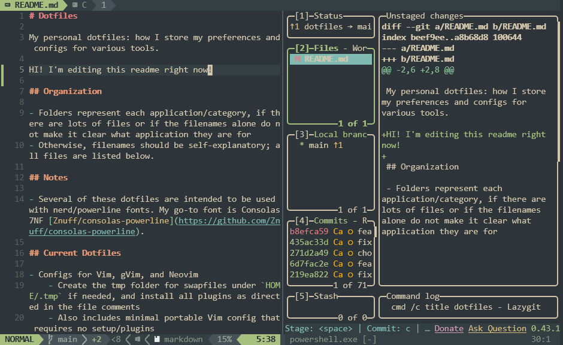

# Dotfiles

My personal dotfiles: how I store my preferences and configs for various tools.

## Organization

- Folders represent each application/category (if there are lots of files or if filenames alone are unclear)
- Otherwise, filenames should be self-explanatory; all files are listed below.

## Notes

- Several of these dotfiles are intended to be used with nerd/powerline fonts. My go-to font is Consolas7NF [Znuff/consolas-powerline](https://github.com/Znuff/consolas-powerline).

## Current Dotfiles

- Configs for Vim, gVim, and Neovim
    - Create the tmp folder for swapfiles under `~/.tmp` if needed, and install all plugins as directed in the file comments
    - Also includes minimal portable Vim config that requires no setup/plugins
- Config for lf terminal file manager (lfrc and icons)
- Config for qutebrowser (config and autoload)
- Config for the yasb status bar (config and styles)
- Config for tmux
    - Follow directions in the file comments
- Config for WezTerm
    - On Windows 10, remove the blur/transparency section
- Config for Zsh
    - Follow directions in the file comments
- Config for Alacritty
- Config for komorebi tiling window manager
- Config for PowerShell (put under `~/Documents/WindowsPowerShell`)
- Configs for Hyprland ecosystem
    - Also relies on Wezterm, Wofi, Waybar, Swaybg, Cadecraft/remslice, and others
    - Config for Hyprland
    - Config for Hyprlock
- Config for Waybar
- Config for Wofi (styles)
- Config for user directories on Linux
