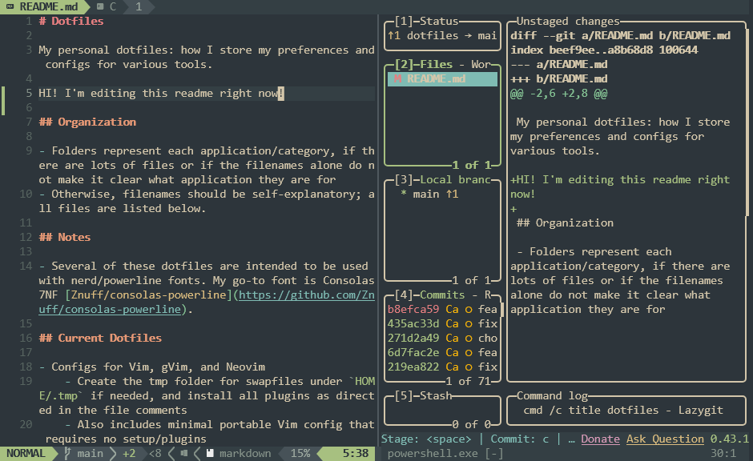

# Dotfiles

My personal dotfiles: how I store my preferences and configs for various tools.

## Organization

- Folders represent each application/category (if there are lots of files or if filenames alone are unclear)
- Otherwise, filenames should be self-explanatory

## Notes

- Several of these dotfiles are intended to be used with nerd/powerline fonts. My go-to font is Consolas7NF [Znuff/consolas-powerline](https://github.com/Znuff/consolas-powerline).

## Current Dotfiles

I currently have configs for the following programs. Additional instructions are included.

### Tools
- Vim, gVim, and Neovim
    - Create the tmp folder for swapfiles under `~/.tmp` if needed, and install all plugins as directed in the file comments
    - Also includes minimal portable Vim config that requires no setup/plugins
- lf terminal file manager (lfrc and icons)
- qutebrowser (config and autoload)
- tmux
    - Follow directions in the file comments

### Shell/terminal
- WezTerm
    - On Windows 10, remove the blur/transparency section
    - Depending on which Consolas Nerd Font you installed, the name may be `Consolas 7NF` or `Consolas Nerd Font Mono`
- Windows Terminal settings (including Iceberg theme)
    - `Ctrl+,` -> "Open JSON File" in the bottom left, and update that file's contents
- Alacritty
- PowerShell (put under `~/Documents/WindowsPowerShell`)
- Zsh
    - Follow directions in the file comments
- User directories on Linux

### Desktop
- Komorebi tiling window manager
- Hyprland ecosystem
    - Also relies on Wezterm, Wofi, Waybar, Swaybg, Cadecraft/remslice, and others
    - Config for Hyprland
    - Config for Hyprlock
- yasb status bar (config and styles)
- Waybar
- Wofi (styles)
